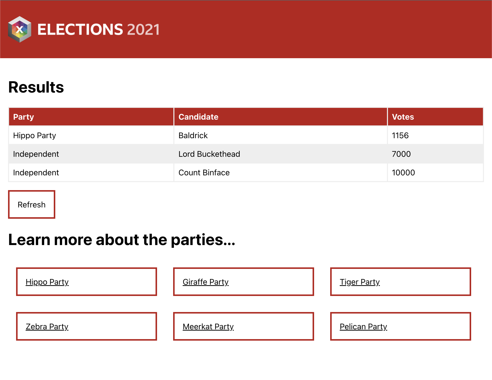

Various team members have asked us to make some changes to the application. They are unfortunately not available to clarify the below so we are being trusted in our interpretation of them!

When you are working on the application you will also need to run and update the tests associated with the components that you change.  Use `npm test` to run the tests from the command line.

To do:
=======

1) We have a failing test a previous developer has left for us! Let's make it pass.

2) There are no candidate names!

- The product owner would like to see the candidate names added to the UI. The candidate ID numbers are meaningless to the audience.

3) Our UX designer thinks the "Learn more about the parties..." section looks boring. 
- Can you change it to be a 3-across grid and match the design we've provided below?
- Can you make each link grow by 10% when hovered?

4) The product owner wants a way to tell when the counting has finished and a winner has been declared.

- Can we make it clear when the counting is complete?
- Can we calculate the winner and highlight them in the table somehow?
- When counting is complete can we remove the refresh button?

5) UX don't like that the table vanishes when they press "refresh"?

- Can it not do this? Obviously it still needs to update the data!
